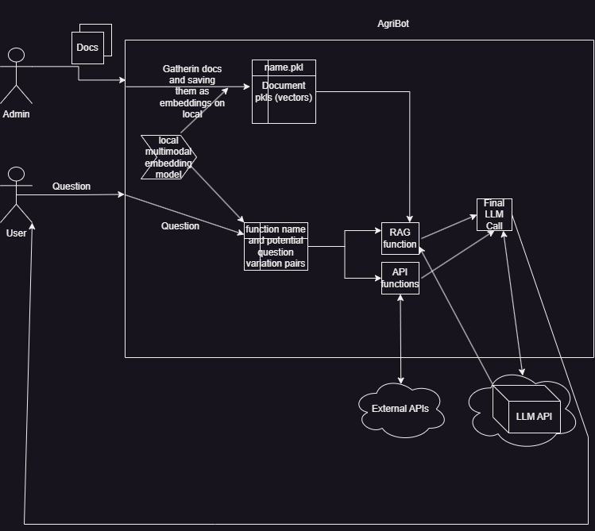

# Agribot

Agribot is a chatbot that does function calling.    
One of Agribot's function is RAG (retrieval augmentation) a.k.a document question-answering.   
Agribot has many functions with their possible questions defined.   
Local running (on CPU) multilanguage LLM decides which of the defined function is similar to the question.  

### Architecture Design

# TODO
* Test the memory in detail  
* Accuracy improvements (tuning hyperparameters, trying llamaindex as rag agent)    
* Checking with Giskard for vulnerabilities because product is served directly to the end user.   